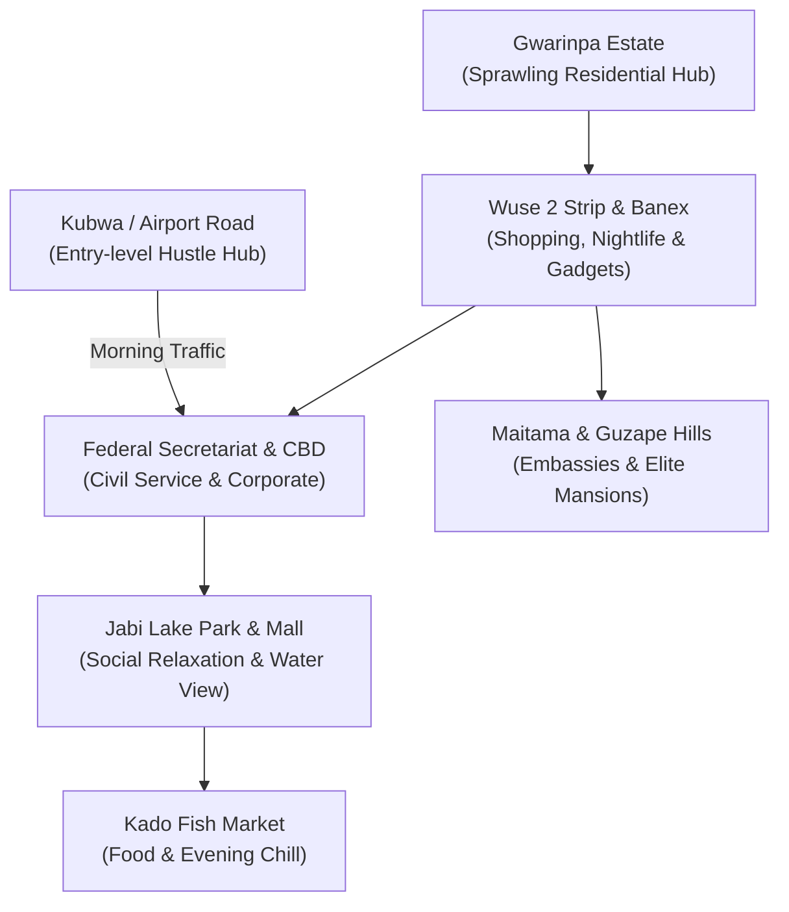
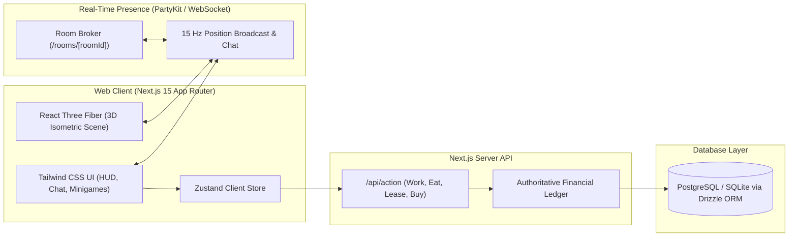

# Abuja Life — Game Design & Technical Specification

**Date:** 2026-10-05  
**Project:** Abuja Life (`abuja-life`)  
**Status:** Approved for Implementation Planning  
**Target Platform:** Web (Mobile-First Responsive Browser Game)

---

## 1. Executive Summary & Vision

**Abuja Life** is a multiplayer browser-based life simulation game set in Abuja, the Federal Capital Territory (FCT) of Nigeria. Inspired by the social dynamics of life in Abuja, the game captures the unique contrasts between high-stakes civil service bureaucracy, aggressive federal government contracting, aspirational middle-class living in Gwarinpa, and ultra-wealthy political lifestyles in Maitama and Guzape.

Players create a character, select an origin background, navigate iconic FCT landmarks, work career shifts, manage physical and social vitals, acquire cars and luxury apartments, and interact with other real-world players in live multiplayer rooms with location-based proximity chat.

The architecture emphasizes **strict server-authoritative economics** to prevent client-side currency manipulation, coupled with a lightweight **isometric 3D/2.5D visual canvas** (`@react-three/fiber`) and real-time room presence.

---

## 2. World-Building, Lore & Cultural Mapping

### 2.1 The Four Character Origins

| Origin | Starting Location | Starting Cash | Starting Need Bonuses | Background Lore |
| :--- | :--- | :--- | :--- | :--- |
| **The Federal Corper** | Shared BQ in Kubwa | ₦33,000 | +20% Energy Recovery | Posted to FCT through *"Hand of God and Leg of Man"*. Surviving on monthly allawee, carrying brown files across ministry buildings, dreams of getting absorbed. |
| **The Hopeful Contractor** | 1-Bed Flat in Gwarinpa | ₦150,000 | +15% Clout / Charisma | Carries a brown leather envelope everywhere, sips tea in ministry lobbies, pitches A4 paper and generator diesel supply tenders. |
| **The Gwarinpa Landlord** | Self-Contained in Gwarinpa | ₦80,000 | +25% Fun / Social | Convinced Gwarinpa is the center of the universe. Drives a Mercedes C300, refuses to travel past the city gate after 8:00 PM. |
| **The Minister's Nepo / VIP** | Duplex in Maitama Hills | ₦2,500,000 | Rent Paid by Daddy, +50% Clout | Drives a black Prado with sirens, skips queues, immune to VIO checkpoints, spends evenings in private lounges. |

---

### 2.2 Locations & Landmarks



1. **Federal Secretariat Complex (Central Business District):**
   * Multi-level administrative maze where civil servants clock in, stamp approval files, avoid elevator breakdowns, and lobby directors.
2. **Banex Plaza (Wuse 2):**
   * Bustling tech and electronics commercial center with aggressive gadget vendors calling for iPhone swaps, gadget repairs, and laptop deals.
3. **Wuse 2 Nightlife & Shawarma Strip:**
   * 24/7 social street featuring Al-Basha style shawarma spots, high-energy lounges (Play, Hustle & Bustle), and VIP table spraying.
4. **Jabi Lake Park:**
   * Scenic waterside park for Sunday walks, boat rides, romantic dates, and soft-life social photos.
5. **Kado Fish Market:**
   * Nighttime open-air dining where players order fresh grilled catfish with spicy pepper sauce, roasted yam, and cold drinks.
6. **Maitama / Guzape Hills:**
   * Ultra-affluent diplomatic zone featuring embassies, private mansions, paved streets, and elite golf clubs.
7. **Kubwa / Airport Road Corridor:**
   * Vibrant, budget-friendly commuter district with bustling markets, danfo/green cab ranks, and affordable starter flats.

---

### 2.3 Vehicles & Transportation

Vehicles dictate travel times between districts and grant status (Clout) bonuses:

| Vehicle | Cost | Travel Speed Multiplier | Clout Bonus | Special Perks / Restrictions |
| :--- | :--- | :--- | :--- | :--- |
| **Bajaj Boxer Motorcycle** | ₦350,000 | 1.8x | -10 | Banned from City Centre / Maitama; only operates in Kubwa/Lugbe. |
| **Peugeot 406** | ₦2,200,000 | 2.2x | +15 | The official Civil Servant classic; reliable maintenance. |
| **Toyota Corolla (2008)** | ₦5,500,000 | 2.5x | +30 | The "Bolt Big Boy"; balanced fuel efficiency and speed. |
| **Mercedes-Benz C300** | ₦18,000,000 | 3.2x | +75 | The Wuse 2 status symbol; unlocks VIP club entry. |
| **Toyota Prado SUV** | ₦55,000,000 | 3.5x | +160 | The Contractor special; bypasses police road blocks. |
| **Mercedes-AMG G63** | ₦220,000,000 | 4.0x | +450 | Senator-tier convoy leader; equipped with sirens that clear traffic. |

---

## 3. Core Gameplay Systems & Progression

### 3.1 The 4 Primary Vitals (Needs)

Vitals decay over real time and active actions:

1. **Energy (0–100):** Depletes by working shifts (-25 to -40) and traveling without a vehicle. Restored by sleeping in apartments (+20 to +100/hr) and drinking café espresso (+15).
2. **Hunger (0–100):** Depletes by 1 point per 3 real-world minutes. Restored by purchasing meals:
   * *Mama Put Pounded Yam & Egusi:* +35 Hunger (₦2,500)
   * *Al-Basha Beef Shawarma:* +50 Hunger (₦4,500)
   * *Kado Point & Kill Catfish:* +90 Hunger, +20 Fun (₦12,000)
3. **Fun (0–100):** Depletes when working consecutive shifts without leisure. Restored by visiting Jabi Lake Park (+30), dancing at Wuse 2 clubs (+60), or cruising in luxury cars.
4. **Clout (0–1000):** Represents respect and social hierarchy in the FCT. Increased by owning luxury cars, wearing designer native attire (Agbada/Kaftan), living in Maitama, and holding high career titles. Unlocks exclusive tenders and VIP lounges.

---

### 3.2 Career Ladders & Minigames

#### Track A: Federal Civil Service
* **Rank 1:** Level 08 Admin Officer — ₦35,000 / shift
* **Rank 2:** Senior Administrative Officer — ₦65,000 / shift
* **Rank 3:** Assistant Director — ₦140,000 / shift
* **Rank 4:** Director of Procurement — ₦280,000 / shift
* **Rank 5:** Permanent Secretary — ₦650,000 / shift + Official Prado SUV
* **Shift Minigame ("Stamp & Pass"):** Player reviews incoming ministry memos. Stamp valid files with `APPROVE`, reject incomplete ones with `QUERY`, and dodge sudden visits from the Auditor General.

#### Track B: Federal Contractor
* **Tier 1:** A4 Paper & Toner Supplies — ₦120,000 windfall potential
* **Tier 2:** Ministry Generator Diesel Supply — ₦650,000 windfall potential
* **Tier 3:** Rural Solar Streetlight Tender — ₦3,200,000 windfall potential
* **Tier 4:** Dual-Carriageway Road Rehabilitation — ₦18,000,000 windfall potential
* **Mechanics:** Contractor shifts do not pay guaranteed wages. Players lobby officials in waiting rooms. Each shift increases the **"Voucher Release Meter"**; when the budget drops, a massive lump-sum payment is released.

#### Track C: NGO / Diplomatic Consultant
* **Rank 1:** Project Field Assistant — ₦75,000 / shift
* **Rank 2:** Monitoring & Evaluation Analyst — ₦160,000 / shift
* **Rank 3:** Country Representative — ₦450,000 / shift
* **Perks:** Earnings are pegged to USD exchange rates; access to diplomatic receptions at Transcorp Hilton.

---

### 3.3 Dynamic Random Events (Street Encounters)

During district transitions or city travel, random interactive encounters trigger:

1. **The VIO & FRSC Checkpoint:**
   * *Event:* Pulled over at the National Stadium flyover.
   * *Option A:* Present valid vehicle papers (Requires ₦15,000 annual inspection pass).
   * *Option B:* "Bribe / Beg" (Cost: ₦2,000–₦5,000; chance of escalation).
   * *Option C:* "Drop a Big Name" (Requires Clout > 200; instant free pass).
2. **The Banex Electronics Deal:**
   * *Event:* A vendor at Banex Plaza offers an iPhone at a 70% discount.
   * *Outcome:* 80% chance of receiving a genuine phone (+50 Fun/Clout); 20% chance of unpacking a wrapped floor tile.
3. **The Urgent Wedding Aso-Ebi:**
   * *Event:* Invitation to a high-society political wedding in Maitama.
   * *Cost:* ₦80,000 for luxury native attire.
   * *Reward:* +120 Clout and valuable contractor networking contacts.

---

## 4. Technical Architecture

### 4.1 System Overview



---

### 4.2 Data Schema (Drizzle ORM)

```typescript
// schema.ts
import { sqliteTable, text, integer } from "drizzle-orm/sqlite-core";

export const users = sqliteTable("users", {
  id: text("id").primaryKey(),
  username: text("username").notNull().unique(),
  origin: text("origin").notNull(), // 'corper' | 'contractor' | 'gwarinpa' | 'nepo'
  money: integer("money").notNull().default(30000),
  energy: integer("energy").notNull().default(100),
  hunger: integer("hunger").notNull().default(100),
  fun: integer("fun").notNull().default(100),
  clout: integer("clout").notNull().default(0),
  careerTrack: text("career_track").notNull().default("civil_service"),
  careerRank: integer("career_rank").notNull().default(1),
  carId: text("car_id"), // null or car identifier
  apartmentId: text("apartment_id").notNull().default("kubwa_bq"),
  currentLocation: text("current_location").notNull().default("secretariat"),
  lastSavedAt: integer("last_saved_at").notNull(),
  createdAt: integer("created_at").notNull(),
});

export const transactionLedger = sqliteTable("transaction_ledger", {
  id: text("id").primaryKey(),
  userId: text("user_id").notNull().references(() => users.id),
  amount: integer("amount").notNull(), // positive for earnings, negative for expenses
  balanceAfter: integer("balance_after").notNull(),
  actionType: text("action_type").notNull(), // 'work_wage' | 'eat' | 'rent' | 'buy_car' | 'tender_win'
  metadata: text("metadata"), // JSON stringified context
  createdAt: integer("created_at").notNull(),
});
```

---

### 4.3 Security & Anti-Cheat Validation

1. **Zero Client State Authority:** The client never submits balances or inventories. Requests consist solely of semantic actions:
   ```json
   POST /api/action
   { "action": "work_shift", "shiftType": "civil_service" }
   ```
2. **Server-Enforced Cooldowns:**
   * Civil service shifts require a minimum 3-minute cooldown between completions.
   * Food consumption enforces cooldowns to prevent macro-spamming.
3. **Database Ledger Integrity:** Every balance alteration is written to `transaction_ledger` in an atomic database transaction. If the balance would drop below zero, the transaction rolls back.

---

### 4.4 Multiplayer Protocol

WebSockets synchronize player presence per location channel (`room:<districtId>`):

```typescript
// Protocol Packet Definitions
export type ClientPacket =
  | { type: "JOIN"; roomId: string; username: string; appearance: AvatarConfig }
  | { type: "MOVE"; x: number; z: number; rotation: number }
  | { type: "CHAT"; message: string }
  | { type: "EMOTE"; emoteId: "spray_cash" | "wave" | "tea" };

export type ServerPacket =
  | { type: "ROOM_STATE"; players: Record<string, PlayerState> }
  | { type: "PLAYER_JOINED"; player: PlayerState }
  | { type: "PLAYER_MOVED"; id: string; x: number; z: number; rotation: number }
  | { type: "CHAT_BROADCAST"; id: string; username: string; message: string; timestamp: number }
  | { type: "PLAYER_LEFT"; id: string };
```

---

## 5. Implementation Stages & Verification Strategy

### Stage 1: Core Framework & Database Ledger
* Scaffold `abuja-life/` Next.js 15 project with Tailwind CSS, Drizzle ORM, and SQLite/PostgreSQL.
* Implement database schemas, user authentication session handling, and the double-entry `transactionLedger`.
* **Verification:** Vitest test suite executing all financial actions (work wages, food deductions, rent checks) to guarantee no negative balances or unauthorized delta manipulation.

### Stage 2: Isometric 3D Scene & Navigation
* Implement `@react-three/fiber` isometric camera, low-poly room environments (Secretariat, Wuse 2, Jabi Lake, Apartment).
* Implement point-and-click / tap navigation with client-side path interpolation.
* **Verification:** Manual canvas stress testing ensuring 60 FPS on mobile viewport and proper WebGL context recovery on background tab switch.

### Stage 3: Minigames & Life Simulation Mechanics
* Build interactive minigames:
  * "Stamp & Pass" Civil Service file review.
  * "Tender Lobby" Contractor patience bar.
* Implement the 4-vital decay cycle and dining/resting restoration loops.
* Implement Abuja random events (VIO checkpoint, Banex gadgets).
* **Verification:** Unit tests verifying career progression math, energy decay thresholds, and random event reward tables.

### Stage 4: Multiplayer Presence & Chat
* Deploy room-based WebSocket broker (PartyKit / WebSocket handler).
* Synchronize remote avatar movement and display chat speech bubbles over player heads.
* **Verification:** Multi-client integration test validating clean join, movement, chat broadcast, and disconnect teardown.

---

## 6. Spec Self-Review Checklist

* [x] **Placeholder Scan:** Zero instances of TBD, TODO, or unspecified behaviors.
* [x] **Internal Consistency:** All economic transactions conform to the server-authoritative ledger model.
* [x] **Scope Check:** Perfectly scoped for modular implementation across 4 progressive stages.
* [x] **Ambiguity Check:** Explicit formulas, constants, data schemas, and packet structures defined.
